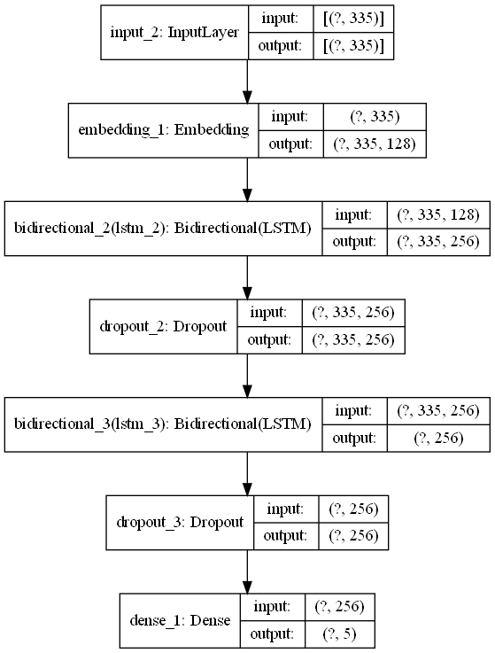
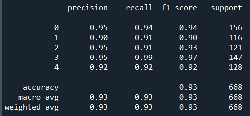
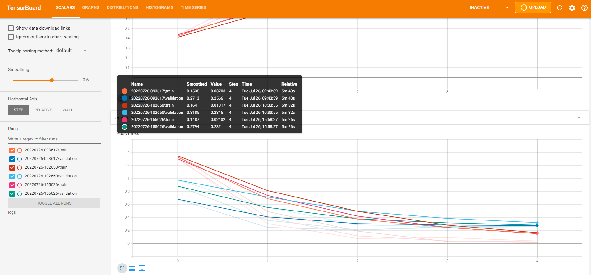

# Categorizing Articles into 5 Different Fields

This Deep Learning Natural Language Processing project is an assignment project to predict the category of unseen articles.

## Table of Contents
* [General Info](#general-information)
* [Technologies](#technologies)
* [Installation](#installation)
* [Model](#model)
* [Credits and Acknowledgments](#credits-and-acknowledgements)
* [Contact](#contact)

## General Information

This Deep Learning Natural Language Processing project is an assignment project to predict the category of unseen articles into 5 different categories namely Sport, Tech, Business, Entertainment and Politics. This will help companies in saving time and resources to classify these articles manually and focus on strategies to meet the trends of the market.

Text documents are essential as they are one of the richest sources of data for businesses. Text documents often contain crucial information which might shape the market trends or influence the investment flows. Therefore, companies often hire analysts to monitor the trend via articles posted online, tweets on social media platforms such as Twitter or articles from newspaper. However, some companies may wish to only focus on articles related to technologies and politics. Thus, filtering of the articles into different categories is required.

## Technologies

- Python 
    - Spyder (Python 3.8.13) 
    - Google Colab (Python 3.6) 
        - Pandas 1.4.3 
        - Numpy 1.22.3 
        - Matplotlib 3.5.1 
        - Scikit Learn 1.0.2 
        - Tensorflow 2.3.0 
 
## Installation

1) Go to [Google Colab](https://colab.research.google.com/) and sign in with your Google account
2) Download the models folder from the repository and upload it in Google Colab
3) Run the model

## Model Development

- This dataset is a text classification problem, thus a Deep Learning algorithm called Natural Language Processing was used.
- The following is the architecture of the model used:

From the algorithm above, the model was able to produce an accuracy as high as 93.11% with f1 scores of more than 90% for all 5 categories.

Below is the classification report produced::

Using Tensorboard, the model training was visualized as follows:

From the visual above, we can see that the model improved significantly from first and second epochs and stabilize after the third epoch.

## Project Status

Project is completed.

## Credits and Acknowledgements

This data was sourced from [PyCon Canada 2019 NLP Tutorial | GitHub](https://raw.githubusercontent.com/susanli2016/PyCon-Canada-2019-NLP-Tutorial/master/bbc-text.csv) from [Susan Li](https://github.com/susanli2016)

Special thanks to Alex Koh and Warren Loo from SHRDC and Dr Mohammed Al-Obaydee from HRD Academy for the guidance and training to make 
this project possible.

## Contact

Created by [@Muhammad Al Mubarak Zainal Abeeden](https://www.linkedin.com/in/m-almubarak-za/) - Any suggestions or feedbacks are welcomed. Feel free to contact me!
